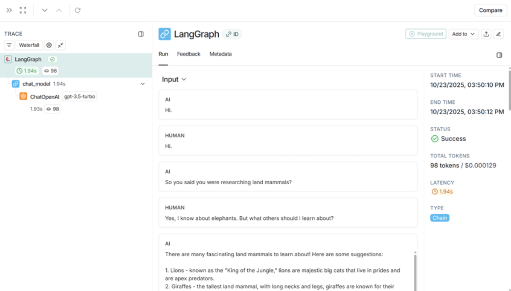

# Langgraph Anshul Virmani 2210110172 MAT496

**Module 1**

Video 1: Motivation

I learned that LangGraph helps overcome the usual limitations of language models, especially their lack of access to tools and external context like documentation. The video also talked about how basic LLMs fall short in certain tasks and introduced the idea of control flow. I also got a clearer understanding of chain architecture and agent architecture.

Video 2: Simple Graph

What I Learned: I learned how to create a basic graph structure using LangGraph, starting with defining a custom state using TypedDict, writing simple Python functions as nodes, and connecting these nodes with both normal and conditional edges. I also saw how a conditional edge can route execution differently based on logic, making the graph dynamic and interactive.

Changes in Code: I expanded the base graph by adding extra nodes and changing the conditional logic to randomly select between more options (e.g. choosing between multiple drink nodes). The graph’s state was customized to carry a user-specific string, and the output was observed at each node during execution to verify the logic. Being comfortable with state schemas and node function signatures also helped in tweaking the sequence and logic of the graph flow.​

[View Notebook](https://github.com/anshul1204/anshul1204-langgraph-mat496/blob/main/module-1/simple-graph.ipynb)

Video 3: Langsmith Studio 

What I Learned: I learned how to download LangSmith Studio and use it to visualize and test graphs, and also how it helps track each step in the workflow. I also got to see how graphs can be viewed as proper flowcharts inside LangSmith Studio, instead of the basic visualization we used to see earlier in Jupyter Notebook.

Changes in Code: I updated the simple.py file by adding a new node and adjusted the probabilities by changing it from 50% to 33% because of the extra node. The new node represented a ‘bored’ state. I also tested the agent graph by asking it to multiply 10 and 2, and it successfully performed the multiplication.

[View Notebook](https://github.com/anshul1204/anshul1204-langgraph-mat496/blob/main/module-1/studio/simple.py)

Video 4: Chain

What I Learned: In this part, i learned how to extend graphs into more complex chains. I focused on using chat messages as state through LangGraph’s pre-built MessagesState, incorporating sequence of messages for context between nodes. I learned how to append messages across steps using reducer functions and how to use LLM chat models and tool bindings for real conversations, not just static data.

Changes in Code: I customized the chain to support real conversational flows by adding sample message lists, switching between human and AI message types, and binding custom translation and arithmetic tools to the model. The tweaks included testing tool invocation inside the chain for example, triggering translations or math based on specific user messages and verifying the reducer logic so that all chat history persisted as the chain progressed.

[View Notebook](https://github.com/anshul1204/anshul1204-langgraph-mat496/blob/main/module-1/chain.ipynb)

Video 5: Router

What I Learned: I explored the concept of routers within LangGraph, where the model routes between returning a direct response or calling a tool, based on the user’s input. This section reinforced how conditional edges and tool-calling logic drive simple “agent” behavior within a graph.

Changes in Code: I updated the router graph to demonstrate tool vs natural language path selection explicitly. Functions like language translation or arithmetic could be routed based on detected intent in the message, with clear logging at decision points. I cleaned up the tool call schema, ensured logging of routes, and tested different user prompts to confirm the control flow was handling all edges correctly.

[View Notebook](https://github.com/anshul1204/anshul1204-langgraph-mat496/blob/main/module-1/router.ipynb)

Video 6: Agent 

What I Learned: Here I built a general agent architecture based on the ReAct design, where the LLM model can loop between reasoning, acting (via tool calls), and observing results until deciding to give a final answer. This modular approach supports complex sequences and multiple tool decisions before producing a direct output.

Changes in Code: I wrote arithmetic tools (add, multiply, divide etc.) and extended the agent to handle binary and two’s complement operations. I updated the tool list and LLM bindings, and tested flows where the agent had to chain tool calls (e.g. do math, convert to binary, handle two’s complement logic, and then convert back to decimal). The graph flow was enhanced with debugging statements and more robust node-to-node connections to support advanced tool chaining.

[View Notebook](https://github.com/anshul1204/anshul1204-langgraph-mat496/blob/main/module-1/agent.ipynb)

Video 7: Agent with Memory

What I Learned: I learned how to extend agent architectures in LangGraph by introducing memory. Now, agents can remember previous steps in a conversation and use checkpoints to persist state, which lets the assistant recall past user messages and calculations even after interruptions.​

Changes in Code: I set up in-memory checkpointing using the built-in MemorySaver, so the graph can store and retrieve state with a thread id. I expanded my toolset to include binary conversion and two's complement logic, and tested the agent with multi-step arithmetic and conversions, verifying memory by resuming conversations and operations after state updates and interruptions.

[View Notebook](https://github.com/anshul1204/anshul1204-langgraph-mat496/blob/main/module-1/agent-memory.ipynb)

**Module 2**

Video 1: State Schema

What I Learned: I reviewed various ways to define a LangGraph state schema, including TypedDict, Literal, and Dataclasses. I understood how to declare keys, constrain values and how nodes expect and communicate state using these schemas. Learned the difference between static type hints and actual runtime validation.

Changes in Code: Introduced specific typed state schemas using TypedDict with literals for constrained values. Tried dataclasses for more concise data structures, adjusting how node functions access data accordingly (attribute access for dataclasses vs dictionary keys). Created sample graphs testing each state type.

[View Notebook](https://github.com/anshul1204/anshul1204-langgraph-mat496/blob/main/module-2/state-schema.ipynb)

Video 2: State Reducers

What I Learned: This part helped me in understanding state reducers which define how updates to state keys/channels happen. It covered different approaches to define the state schema with Python TypedDict, Pydantic, or Dataclasses and how reducers specify overwriting or custom update logic for each key.

Changes in Code: I experimented with different reducer types and writing reducer functions that handle adding or merging state values. Tweaked schemas to use literals and custom state classes. Experimented with preserving parts of the state while updating others and coordinating reducer flows with the graph execution.

[View Notebook](https://github.com/anshul1204/anshul1204-langgraph-mat496/blob/main/module-2/state-reducers.ipynb)

Video 3: Multiple Schemas

What I Learned: The video covered customizing LangGraph to use multiple state schemas simultaneously. This is useful to pass “private state” used internally between nodes without exposing it on the graph's inputs or outputs. Also learned how to define distinct input/output schemas for a graph, improving control and security.

Changes in Code: Implemented examples showing the separation of OverallState vs PrivateState. Modified nodes to accept one schema and produce outputs conforming to another. Added input/output schema declarations to graph builders and compiled graphs testing private state passing and partial output folding.

[View Notebook](https://github.com/anshul1204/anshul1204-langgraph-mat496/blob/main/module-2/multiple-schemas.ipynb)

Video 4: Trim and Filter Messages

What I Learned: This video focused on advanced techniques for trimming and filtering messages in the graph state to balance memory and token usage. Various trimming strategies like keeping last N messages or filtering by criteria were tested. This is foundational for building chatbots that sustain longer sessions without hitting token limits.

Changes in Code: I wrote custom trimming functions that selectively trim conversation while preserving necessary context. Tested trimming with allow_partial mode and different max token limits. Integrated trimming logic in chatbot graphs and observed model outputs with varying trimming policies.

[View Notebook](https://github.com/anshul1204/anshul1204-langgraph-mat496/blob/main/module-2/trim-filter-messages.ipynb)

Video 5: Chatbot Summarizing Messages and Memory

What I Learned: I learned how to build a chatbot that uses LLMs to produce a running summary of the conversation, instead of just trimming or filtering messages. This lets the chatbot retain a compressed, context-rich summary, which supports long conversations without increasing token usage or latency. I worked with a custom state extended from MessagesState that included a summary field and developed logic to generate and update the summary dynamically within the conversation flow.

Changes in Code: I modified the summarization node to include summary text in the system message fed to the model. I implemented a summarization function that extends or creates the summary based on new messages and removes older messages to limit state size. I added a conditional edge to trigger summarization only after the conversation exceeds a threshold number of messages (modified to summarizing after 5 messages instead of default). Added tracing setup for LangSmith and tested the thread-based memory persistence.

[View Notebook](https://github.com/anshul1204/anshul1204-langgraph-mat496/blob/main/module-2/chatbot-summarization.ipynb)

Video 6: Chatbot Summarizing Messages and External Memory

What I Learned: This section introduced external persistent memory by incorporating external database-backed checkpointers (like SQLite). This enables chatbots to save and resume conversations across restarts and long durations, overcoming the transient state limitation.

Changes in Code: Set up SQLite checkpointer and connected it to the chatbot graph for state persistence. Rebuilt the chatbot to use this persistent memory with thread IDs. Demonstrated re-loading state after kernel restart, validating memory persistence on disk. Prepared configuration for other DBs like Postgres for production use.

[View Notebook](https://github.com/anshul1204/anshul1204-langgraph-mat496/blob/main/module-2/chatbot-external-memory.ipynb)

**Module 3**

Video 1: Streaming

What I Learned: In this video, I learned how streaming works inside the graph so the model can send partial outputs live. I also learned how streaming can be interrupted so I can change the state mid-stream and then continue the run. It showed how this helps in creating summaries or reacting while the model is still generating.

Changes in Code: I updated my graph so LLM nodes can stream tokens. I enabled streaming modes for state updates and token updates. I added logic to interrupt streaming when needed, based on events or human input. I also integrated checkpoints into the streaming flow and used RunnableConfig to control how the streaming behaves.

Video 2: Breakpoints

What I Learned: I learned the basics of breakpoints where the graph pauses at fixed points so someone can manually approve the next step. It showed how the flow stops, waits for input, and then continues. I also got to see how breakpoints fit into LangChain and LangGraph when we want more human control.

Changes in Code: I added simple breakpoint nodes to my graph and connected them using control-flow edges. I inserted a human approval node to handle pausing and resuming. I used the memory saver and state graph to manage breakpoint states and added streaming so I could see when the graph pauses and starts again. I also imported the tools needed for these advanced nodes.